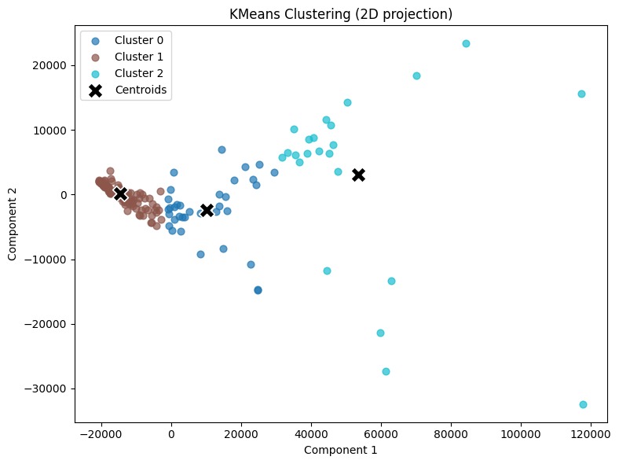
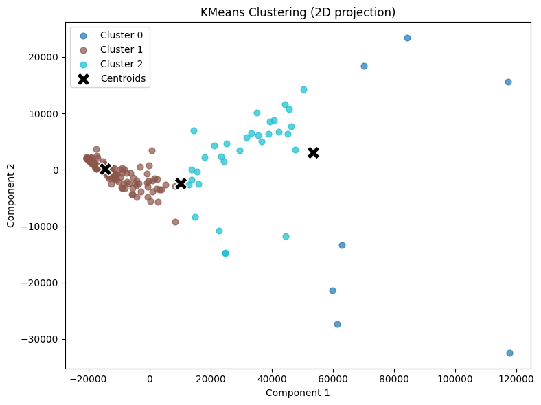

# Machine Learning Implementations

English | [中文](./docs/README_zh.md)

This repository contains implementations of various machine learning algorithms from scratch, along with comparisons to their `sklearn` counterparts.

---

## Contents
- ### Supervised Learning
  - [Linear Regression](#linear-regression)
  - [Logistic Regression](#logistic-regression)
  - [Decision Tree Classifier (CART)](#decision-tree-classifier-cart)
  - [Random Forest Classifier](#random-forest-classifier)
- ### Unsupervised Learning
  - [K-Means Clustering](#k-means-clustering)

---

## Linear Regression
The `LinearRegression` class implements the ordinary least squares method for linear regression. It includes methods for fitting the model to data and making predictions.

Using the dataset from Kaggle [Dataset Link](https://www.kaggle.com/datasets/andonians/random-linear-regression/data), we preprocess the data and train both our custom linear regression model and `sklearn`'s implementation for comparison.

|Method|Accuracy|
|------|---|
|Custom Linear Regression|98.8801%|
|Sklearn Linear Regression|98.8801%|

## Logistic Regression

The `CustomLogisticRegression` class implements logistic regression using gradient descent. It supports fitting to data, making predictions, and evaluating accuracy.

Using the dataset from Kaggle [Dataset Link](https://www.kaggle.com/datasets/dileep070/heart-disease-prediction-using-logistic-regression/data), we preprocess the data and train both our custom logistic regression model and `sklearn`'s implementation for comparison.

|Method|Accuracy|
|------|--------|
|Custom Logistic Regression|85.85%|
|Sklearn Logistic Regression|86.08%|

## Decision Tree Classifier (CART)
The `DecisionTreeCART` class implements the CART algorithm for decision trees. It supports fitting to data, making predictions, and evaluating accuracy.

Using the dataset from Kaggle [Dataset Link](https://www.kaggle.com/datasets/kaushiksuresh147/customer-segmentation/data), we preprocess the data and train both our custom decision tree and `sklearn`'s implementation for comparison.

|Method|Accuracy|
|------|--------|
|Custom CART|34.07%|
|Sklearn CART|34.11%|

## Random Forest Classifier
The `CustomRandomForest` class implements the Random Forest algorithm using multiple decision trees. It supports fitting to data, making predictions, and evaluating accuracy. The base decision tree used is our custom `DecisionTreeCART`.

Using the dataset from Kaggle [Dataset Link](https://www.kaggle.com/datasets/miadul/lifestyle-and-health-risk-prediction), we preprocess the data and train both our custom random forest and `sklearn`'s implementation for comparison.

|Method|Accuracy|
|------|--------|
|Custom Random Forest|86.80%|
|Sklearn Random Forest|86.10%|

**It is surprising that the custom implementation outperforms sklearn in this case.**

---

## K-Means Clustering

The `KMeans` class implements the K-Means clustering algorithm. It includes methods for fitting the model to data and predicting cluster assignments.

Using the dataset from Kaggle [Dataset Link](https://www.kaggle.com/datasets/rohan0301/unsupervised-learning-on-country-data), we preprocess the data and train both our custom K-Means model and `sklearn`'s implementation for comparison.

Scatter plots are generated to visualize the clustering results.

Custom K-Means Clustering Result:

Sklearn K-Means Clustering Result:
