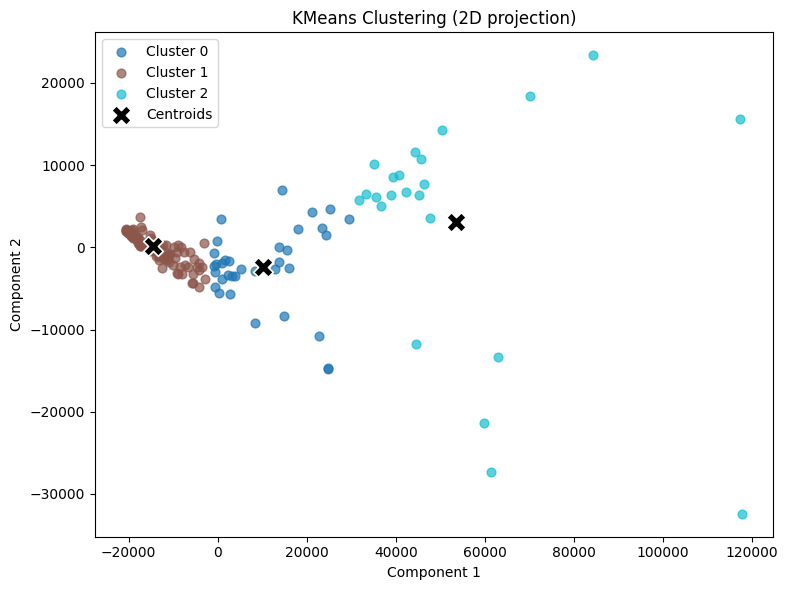

# 机器学习实现

中文 | [English](../README.md)

本仓库包含各种机器学习算法的从零实现，以及与其 `sklearn` 版本的比较。

---

## 目录
- ### 基础
  - [Numpy](#basic)
  - [Pandas](#basic)
  - [Matplotlib](#basic)
- ### 监督学习
  - [线性回归](#线性回归)
  - [逻辑回归](#逻辑回归)
  - [决策树分类器 (CART)](#决策树分类器-cart)
  - [随机森林分类器](#随机森林分类器)
- ### 无监督学习
  - [K均值聚类](#k均值聚类)

---

## 基础
本节包括基本库，如用于数值计算的 Numpy、用于数据处理的 Pandas 和用于数据可视化的 Matplotlib。具体细节可以在 [basic](../basic) 文件夹中找到。

## 线性回归
`LinearRegression` 类实现了线性回归的普通最小二乘法。它包括将模型拟合到数据和进行预测的方法。

使用来自 Kaggle 的数据集 [数据集链接](https://www.kaggle.com/datasets/andonians/random-linear-regression/data)，我们对数据进行预处理，并训练我们的自定义线性回归模型和 `sklearn` 的实现进行比较。

|方法|准确率|
|------|---|
|自定义线性回归|98.8801%|
|Sklearn线性回归|98.8801%|

## 逻辑回归

`CustomLogisticRegression` 类使用梯度下降实现逻辑回归。它支持拟合数据、进行预测和评估准确性。

使用来自 Kaggle 的数据集 [数据集链接](https://www.kaggle.com/datasets/dileep070/heart-disease-prediction-using-logistic-regression/data)，我们对数据进行预处理，并训练我们的自定义逻辑回归模型和 `sklearn` 的实现进行比较。

|方法|准确率|
|------|--------|
|自定义逻辑回归|85.85%|
|Sklearn逻辑回归|86.08%|

## 决策树分类 (CART)
`DecisionTreeCART` 类实现了决策树的 CART 算法。它支持拟合数据、进行预测和评估准确性。

使用来自 Kaggle 的数据集 [数据集链接](https://www.kaggle.com/datasets/kaushiksuresh147/customer-segmentation/data)，我们对数据进行预处理，并训练我们的自定义决策树和 `sklearn` 的实现进行比较。

|方法|准确率|
|------|--------|
|自定义决策树|34.07%|
|Sklearn决策树|34.11%|

## 随机森林分类
`CustomRandomForest` 类实现了随机森林算法，使用多个决策树。它支持拟合数据、进行预测和评估准确性。使用的基础决策树是我们的自定义 `DecisionTreeCART`。

使用来自 Kaggle 的数据集 [数据集链接](https://www.kaggle.com/datasets/miadul/lifestyle-and-health-risk-prediction)，我们对数据进行预处理，并训练我们的自定义随机森林和 `sklearn` 的实现进行比较。

|方法|准确率|
|------|--------|
|自定义随机森林|86.80%|
|Sklearn随机森林|86.10%|

**很神奇当前案例自定义实现的性能在这种情况下优于sklearn。**

---

## K均值聚类

`KMeans` 类实现了 K 均值聚类算法。它包括将模型拟合到数据和预测簇分配的方法。

使用来自 Kaggle 的数据集 [数据集链接](https://www.kaggle.com/datasets/rohan0301/unsupervised-learning-on-country-data)，我们对数据进行预处理，并训练我们的自定义 K 均值模型和 `sklearn` 的实现进行比较。

生成散点图以可视化聚类结果。

自定义 K 均值聚类结果:

Sklearn K 均值聚类结果:
